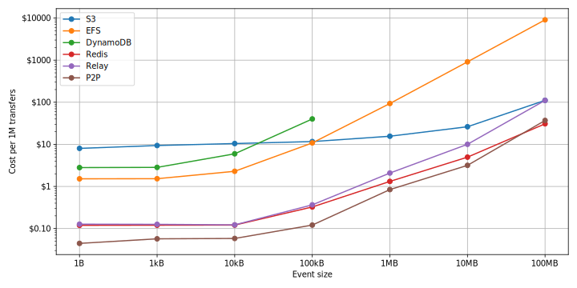

# Bulletin

Python serverless communication framework for distributed AWS Lambda applications. Part of my master's thesis.

Implemented communication methods:

- S3
- EFS
- DynamoDB
- Redis
- Simple relay implementation
- P2P w/ NAT traversal



## Build

```bash
python -m build
```

## Local testing

```bash
virtualenv venv
venv/bin/pip install -e .
venv/bin/python
```

## Publish package to S3

```bash
aws s3 cp dist/bulletin-0.0.5.tar.gz s3://bulletin-py/bulletin/
aws s3 cp dist/bulletin-0.0.5-py3-none-any.whl s3://bulletin-py/bulletin/

# Install bucket-dir first
bucket-dir bulletin-py
```

Use like this in requirements.txt.

```
--extra-index-url https://dxsxsb220w9y2.cloudfront.net
bulletin==0.0.5
```

## Repository Structure

- `src/` - Bulletin source.
- `tf/benchmark/` - Terraform config for point to point benchmarks of event exchange methods.
- `tf/e2e/` - Terraform config for e2e benchmark: federated machine learning.
- `tf/bulletin/` - Publish bulletin on S3.
- `tf/ec2/` - Single VM to run benchmarks with low latency to AWS API.
- `notebooks/` - Jupiter notebooks with benchmark result analysis.
